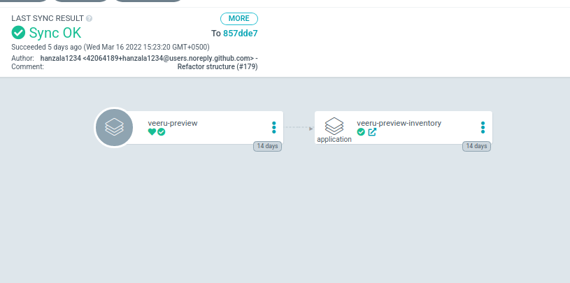
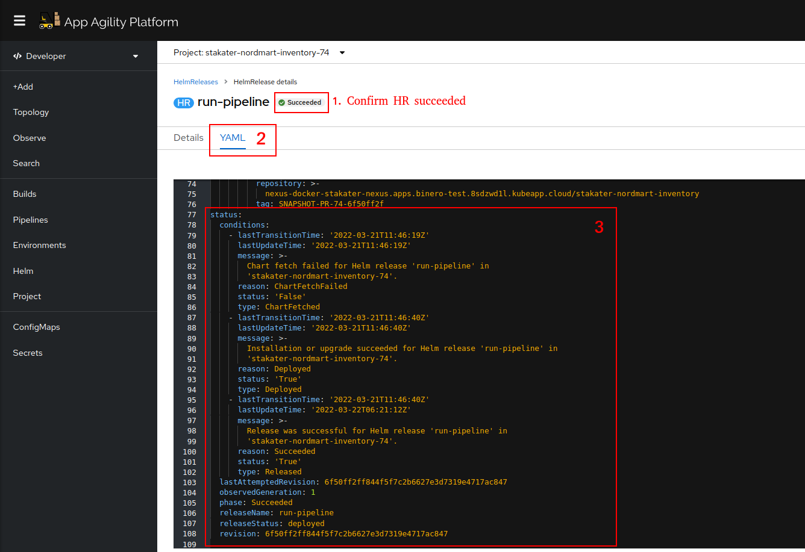

# Troubleshooting

!!! warning Note
    This Troubleshooting Guide is now outdated after the newest changes to Tronador. The Guide will be updated soon.

!!! warning Note
    The guide below is written as a SAAP customer's point of view. If you use Tronador independently, the guide below might not be applicable to you. However, you can still use this guide to get an idea of how the process works.

## Developer support

Environment provisioning takes a few minutes to complete, since there is a lot of steps involved that can take some time (image creation, ArgoCD sync, Helm Operator reconcile, etc). Please take a look at the [workflow for Tronador](./workflow.md) to see how the process works. If the environment is still not provisioned after a few minutes, you can use the following steps to get an idea of why it is taking so long:

* Check your cluster's PipelineRun resource to check its status. If any task fails, you can look at the logs of the failed task to see what went wrong.


* View your GitOps repository to verify that the Environment Provisioner CR is pushed to it.


* Confirm that the Environment Provisioner CR is pushed to your cluster by checking the status of the ArgoCD Application managing its sync.



* Check the status of the Helm Release to see if it is in a good state.




* If everything above looks good, then the pods might be in a failing state. Check the pods deployed to your provisioned namespace and view their events to see if there are any failures, and why. Most likely the issue is a lack of imagePullSecrets in the provisioned namespace.

Those secrets can be added using [Tronador Config](./tronador_config.md) by mentioning the resources in the CR, which will deploy those resources in all DTE Namespaces.
This can also be done by [Multi Tenant Operator's](https://docs.stakater.com/mto/index.html) [TemplateGroupInstance](https://docs.stakater.com/mto/customresources.html#5-templategroupinstance) by setting the proper label in your Tronador config file.

## Cluster Admin support

* In case Helm Release keeps failing, you will need to check Helm Operator's logs to get more information about the failure.
    * If you see constant Helm release failures with the error message `Could not resolve host: github.com` or similar, you might need to change the `dnsConfig` within the template's spec for the Helm Operator's deployment with the following details:

    ```yaml
      dnsPolicy: "ClusterFirst"
      dnsConfig:
        options:
          - name: ndots
            value: "1"
    ```

    The Helm Operator uses an Alpine base image, which has a bad address issue where it cannot resolve addresses unless it has a dot `.` at the end of it. The above workaround will fix this issue.
