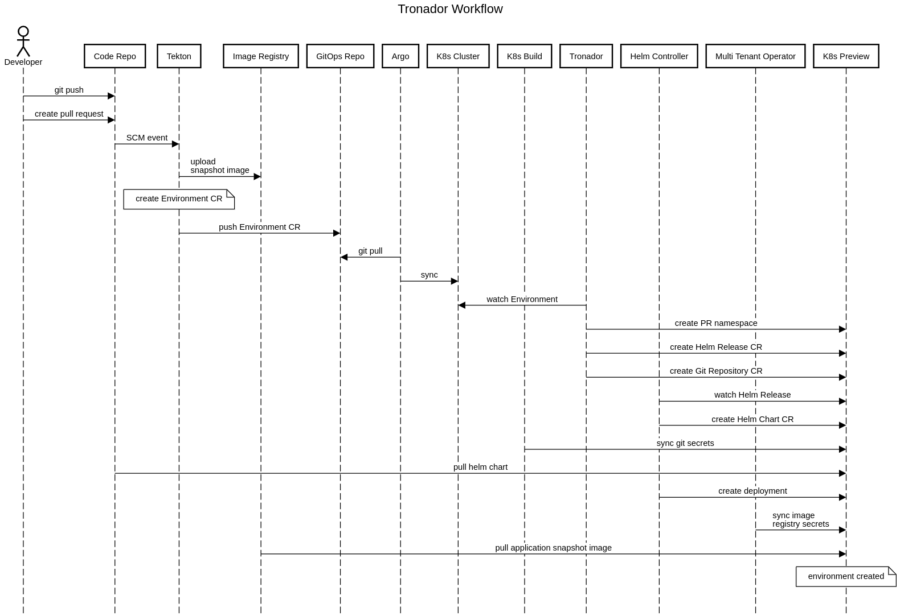
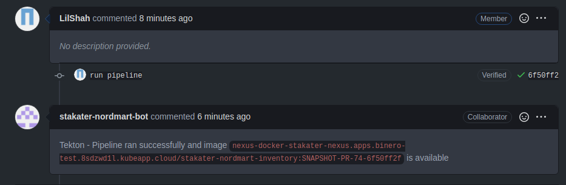
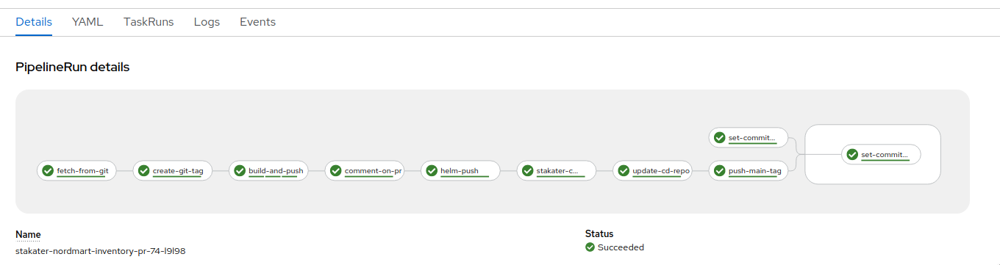
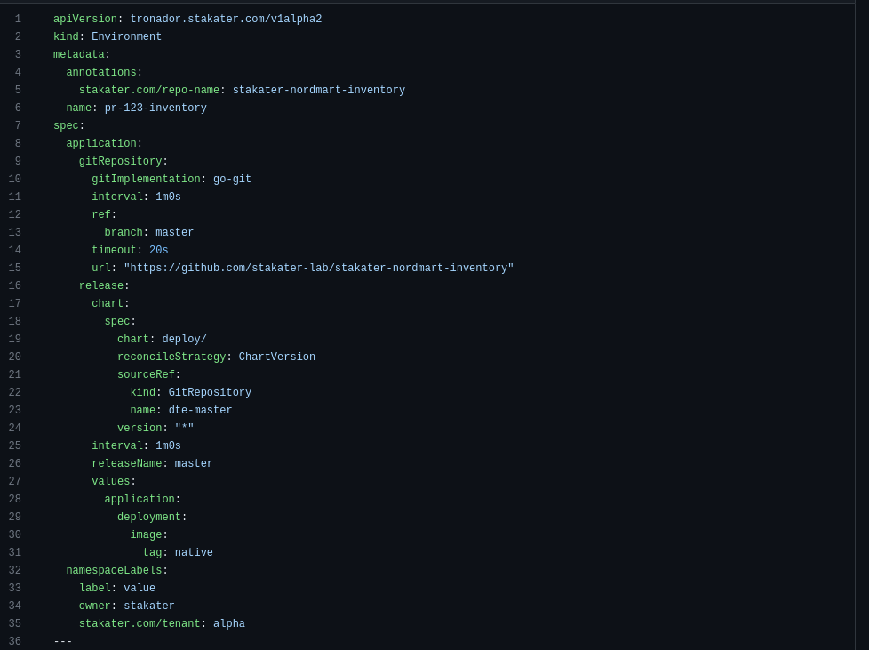
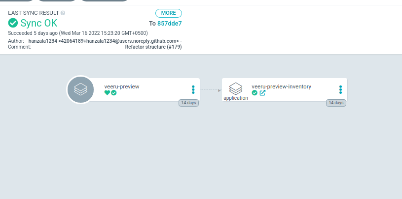

# Workflow guide for Tronador

!!! warning Note
    The guide below is written as a SAAP customer's point of view. If you use Tronador independently, the guide below might not be applicable to you. However, you can still use this guide to get an idea of how the process works.

For Tronador to work, you need to add support for it in your Git Repository by adding a [Tronador config file](./config_file.md). Afterwards, a Tekton pipeline needs to be setup with the [Tronador cluster task](./cluster_task.md), and a cluster task that pushes the output EP to your GitOps repository. Test environments should then be created automatically every time a PR is created or updated. The entire Dynamic Test Environment (DTE) creation process is described below.



## Tronador config file

The [Tronador config file](./config_file.md) is placed in the GitHub repository and is used to configure the Environment CR. Environment Provisioning will only work if the config file exists.

```yaml
application:
  chart_path: deploy
  namespaceLabels:
    kind: pr
    team: gabbar
    stakater.com/tenant: veeru
  value_overrides:
    application:
      deployment:
        image:
          repository: {{APPLICATION_IMAGE_NAME}}
          tag: {{APPLICATION_IMAGE_TAG}}
```

### GitHub Event

 GitHub (or any other repository management system) events are used to trigger the Tronador pipeline. The pipeline is triggered whenever a PR is opened for a repository that supports Tronador.

### Tekton Pipeline

The Tekton Pipeline needs to watch your repo where Tronador is configured to be used, and when a PR is created or updated, it will trigger the Tekton pipeline. The pipeline will first create a docker image from the changes in your PR. It will then create an Environment CR by using the details in the config file, and replacing its `APPLICATION_IMAGE_NAME` and `APPLICATION_IMAGE_TAG` variables in the config file with the details about the created docker image. Finally it will push the Environment to your GitOps repository.





### GitOps Repository

A successful pipeline run will create a new Environment CR, and push it to your GitOps repository.



### ArgoCD push

ArgoCD is a tool that can be used to watch a repo and push the changes to your cluster. In this case, it will push the Environment CR from your GitOps repository to your cluster.



### Environment

The Environment Custom Resource does the actual work of creating the test environment. It is responsible for creating the test environment, and for updating it when the image is updated. The process for this is to first create a namespace, then create HelmRelease and GitRepository resources within that namespace using details about the image to be deployed. These details are gotten from the pipeline and the Tronador config file.

```yaml
apiVersion: tronador.stakater.com/v1alpha2
kind: Environment
metadata:
  annotations:
    stakater.com/repo-name: stakater-nordmart-inventory
  name: pr-123-inventory
spec:
  application:
    gitRepository:
      gitImplementation: go-git
      interval: 1m0s
      ref:
        branch: master
      timeout: 20s
      url: "https://github.com/stakater-lab/stakater-nordmart-inventory"
    release:
      chart:
        spec:
          chart: deploy/
          reconcileStrategy: ChartVersion
          sourceRef:
            kind: GitRepository
            name: dte-master
          version: "*"
      interval: 1m0s
      releaseName: master
      values:
        application:
          deployment:
            image:
              tag: native
  namespaceLabels:
    label: value
    owner: stakater
    stakater.com/tenant: alpha
```

### Helm Release

Helm Releases are watched by the Helm Controller, which manages the creation of all resources listed in a referenced Helm chart. This chart is usually placed within the repo itself, and in this case Tronador passes along the reference to this chart from the Environment to the Helm Release. The only thing that is changed is the image to be deployed, which is passed along from the pipeline with each update to the PR and updated within the Helm release automatically.

```yaml
apiVersion: helm.toolkit.fluxcd.io/v2beta1
kind: HelmRelease
metadata:
  name: dte-master
  namespace: pr-123-inventory
spec:
  chart:
    spec:
      chart: deploy/
      reconcileStrategy: ChartVersion
      sourceRef:
        kind: GitRepository
        name: dte-master
      version: '*'
  install:
    remediation:
      retries: 60
  interval: 1m0s
  releaseName: dte-master
  values:
    application:
      deployment:
        image:
          tag: native
```

### Git Repository

A GitRepository resource is also created in addition to the HelmRelease. This resource specifically has details about where the Git Repository is, and what branch is being used.

```yaml
apiVersion: source.toolkit.fluxcd.io/v1beta2
kind: GitRepository
metadata:
  name: dte-master
  namespace: pr-123-inventory
spec:
  gitImplementation: go-git
  interval: 1m0s
  ref:
    branch: master
  timeout: 20s
  url: 'https://github.com/stakater-lab/stakater-nordmart-inventory'
```

### Secrets management

Secrets for the Helm chart to be deployed are currently passed along from the Tronador config file, to the Helm release.
Secrets for Helm chart and other required resources like image pull secret can be brought into Environment owned namespaces using [Tronador Config](./tronador_config.md) CR.

You can also use [Multi Tenant Operator's](https://docs.stakater.com/mto/index.html) [TemplateGroupInstance](https://docs.stakater.com/mto/customresources.html#5-templategroupinstance) to pass secrets to the namespace that will be provisioned by the Environment by setting the proper label in your Tronador config file. An example for this workflow is [provided here](https://docs.stakater.com/mto/usecases/deploying-templates.html#deploying-template-to-namespaces-via-templategroupinstances).

### Application snapshot deployed

After the entire above process is completed, the Helm Release will create a deployment that will deploy the pods for the application and its changes mentioned in the PR to the namespace created by the Environment.
